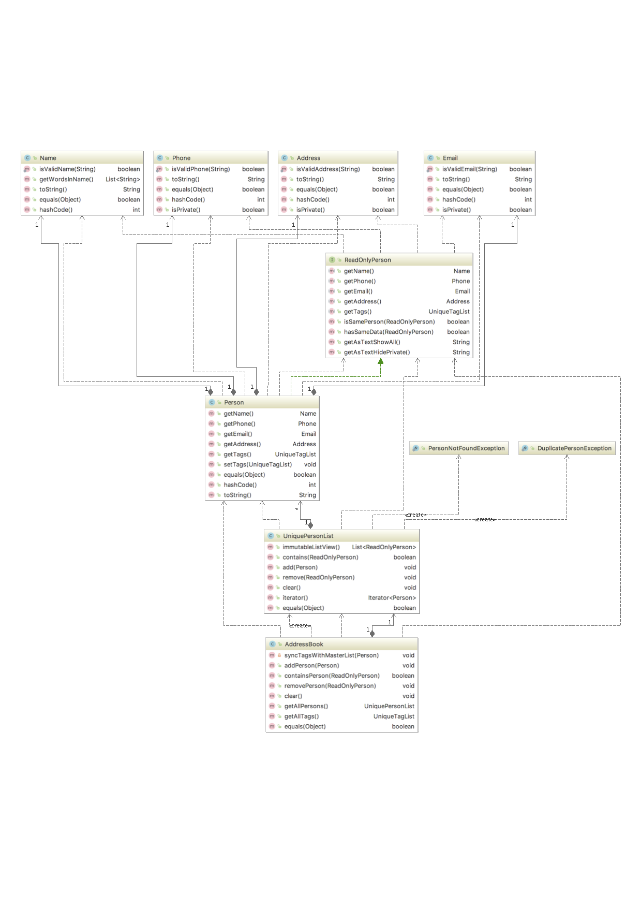

# Developer Guide

## Setting up

**Prerequisites**

* JDK 8 or later 
* IntelliJ IDE

**Importing the project into IntelliJ**

0. Fork this repo, and clone the fork to your computer
1. Open IntelliJ (if you are not in the welcome screen, click `File` > `Close Project` to close the existing project dialog first)
2. Set up the correct JDK version
   1. Click `Configure` > `Project Defaults` > `Project Structure`
   2. If JDK 8 is listed in the drop down, select it. If it is not, click `New...` and select the directory where you installed JDK 8.
   3. Click `OK`.
3. Click `Import Project`
4. Locate the project directory and click `OK`
5. Select `Create project from existing sources` and click `Next`
6. Rename the project if you want. Click `Next`
7. Ensure that your `\src` and `\test\java` folders are checked. Keep clicking `Next`
8. Click `Finish`
9. Add JUnit 4 to classpath
   1. Open any test file in `\test\java` and place your cursor over any `@Test` highlighted in red
   2. Press <kbd>ALT</kbd>+<kbd>ENTER</kbd> and select `Add 'JUnit4' to classpath`
   3. Select `Use 'JUnit4' from IntelliJ IDEA distribution` and click `OK`
10. Run all the tests (right-click the `test` folder, and click `Run 'All Tests'`)
11. Observe how some tests fail. That is because they try to access the test data from the wrong directory (the working directory is expected to be the root directory, but IntelliJ runs the test with `test\` as the working directory by default). To fix this issue:
    1. Go to `Run` -> `Edit Configurations...`
    2. On the list at the left, expand `JUnit`, and remove all the test configurations (e.g. `All in test`) by selecting it and clicking on the '-' icon at the top of the list
    3. Expand `Defaults`, and ensure that `JUnit` is selected
    4. Under `Configuration`, change the `Working directory` to the `addressbook-level2` folder
    5. Click `OK`
12. Run the tests again to ensure they all pass now.

## Design
The class diagram is shown below.

## Testing

**Automated Testing of CLI Apps** 

***using input/output re-direction to semi-altomate testing***

1. Store the test input in the text file input.txt.
    Example input.txt
   `add Valid Name p/12345 valid@email.butNoPrefix` 
   `add Valid Name 12345 e/valid@email.butPhonePrefixMissing`
2. Store the output we expect from the SUT in another text file expected.txt.
   Example expected.txt 
   `Command: || [add Valid Name p/12345 valid@email.butNoPrefix]` 
   `Invalid command format: add`
   `Command: || [add Valid Name 12345 e/valid@email.butPhonePrefixMissing]` 
   `Invalid command format: add` 
3. Run the program as given below, which will redirect the text in input.txt as the input. 
     `java addressbook-level2 < input.txt > output.txt`
4. Compare the actual output file with another file containing the expected output. 
     e.g., `FC output.txt expected.txt`

### I/O tests

**Windows**

1. Open a DOS window in the `test` folder
2. Run the `runtests.bat` script
3. If the script reports that there is no difference between `actual.txt` and `expected.txt`, 
   the test has passed.

**Mac/Unix/Linux**

1. Open a terminal window in the `test` folder
2. Run the `runtests.sh` script
3. If the script reports that there is no difference between `actual.txt` and `expected.txt`, 
   the test has passed.

### JUnit tests

* In IntelliJ, right-click on the `test` folder and choose `Run 'All Tests'`

### Troubleshooting test failures

* Problem: How do I examine the exact differences between `actual.txt` and `expected.txt`? 
  Solution: You can use a diff/merge tool with a GUI e.g. WinMerge (on Windows)
* Problem: The two files look exactly the same, but the test script reports they are different. 
  Solution: This can happen because the line endings used by Windows is different from Unix-based
  OSes. Convert the actual.txt to the format used by your OS using some [utility](https://kb.iu.edu/d/acux).
* Problem: Test fails during the very first time. 
  Solution: The output of the very first test run could be slightly different because the program
  creates a new storage file. Tests should pass from the 2nd run onwards.
