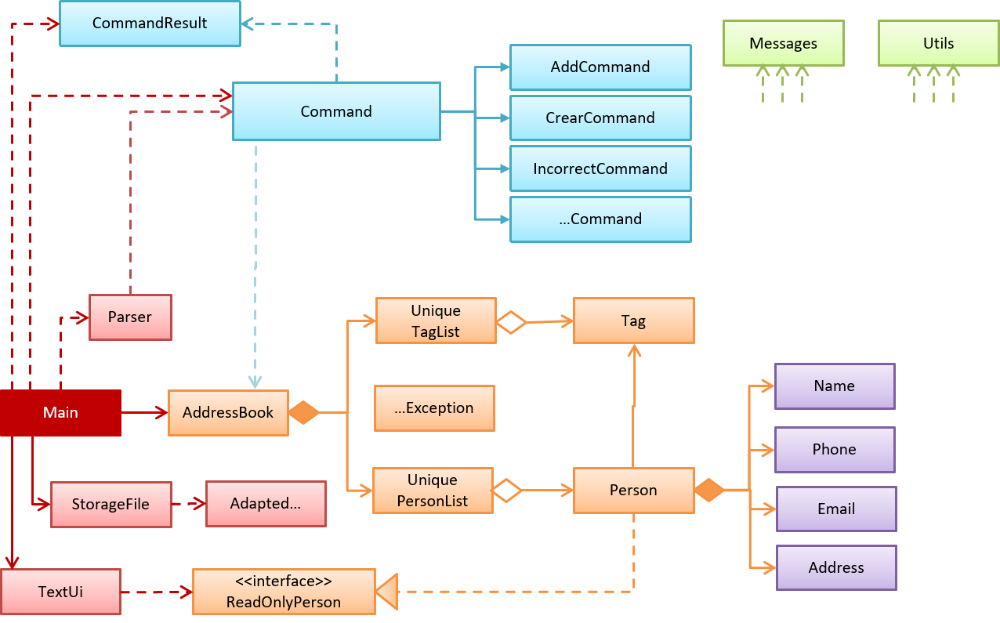

# Developer Guide

## Setting up

**Prerequisites**

* JDK 8 or later 
* IntelliJ IDE

**Importing the project into IntelliJ**

0. Fork this repo, and clone the fork to your computer
1. Open IntelliJ (if you are not in the welcome screen, click `File` > `Close Project` to close the existing project dialog first)
2. Set up the correct JDK version
   1. Click `Configure` > `Project Defaults` > `Project Structure`
   2. Click `New...` and find the directory of the JDK
3. Click `Import Project`
4. Locate the project directory and click `OK`
5. Select `Create project from existing sources` and click `Next`
6. Rename the project if you want. Click `Next`
7. Ensure that your `\src` and `\test\java` folders are checked. Keep clicking `Next`
8. Click `Finish`
9. Add JUnit 4 to classpath
   1. Open any test file in `\test\java` and place your cursor over any `@Test` highlighted in red
   2. Press <kbd>ALT</kbd>+<kbd>ENTER</kbd> and select `Add 'JUnit4' to classpath`
   3. Select `Use 'JUnit4' from IntelliJ IDEA distribution` and click `OK`

## Design

## Testing

### System tests

**Windows**

1. Open a DOS window in the `test` folder
2. Run the `runtests.bat` script
3. If the script reports that there is no difference between `actual.txt` and `expected.txt`, 
   the test has passed.

**Mac/Unix/Linux**

1. Open a terminal window in the `test` folder
2. Run the `runtests.sh` script
3. If the script reports that there is no difference between `actual.txt` and `expected.txt`, 
   the test has passed.

### JUnit tests

* In IntelliJ, right-click on the `test` folder and choose `Run 'All Tests'`

### Troubleshooting test failures

* Problem: How do I examine the exact differences between `actual.txt` and `expected.txt`? 
  Solution: You can use a diff/merge tool with a GUI e.g. WinMerge (on Windows)
* Problem: The two files look exactly the same, but the test script reports they are different. 
  Solution: This can happen because the line endings used by Windows is different from Unix-based
  OSes. Convert the actual.txt to the format used by your OS using some [utility](https://kb.iu.edu/d/acux).
* Problem: Test fails during the very first time. 
  Solution: The output of the very first test run could be slightly different because the program
  creates a new storage file. Tests should pass from the 2nd run onwards.
* Problem: `StorageFileTest` throws `NoSuchFileException` 
  Solution:
  1. Click the `All in test` drop down menu at the top right corner of the window
  2. Select `Edit configurations...`
  3. Under `Configuration`, change the `Working directory` to the `addressbook-level2` folder
