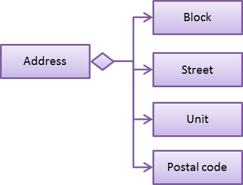
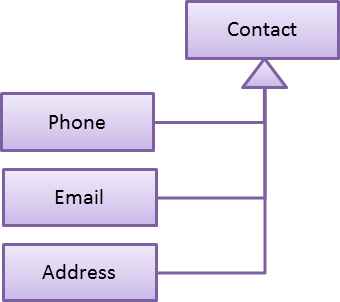
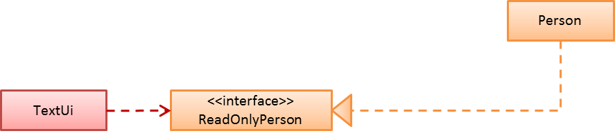
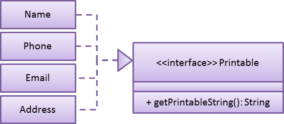
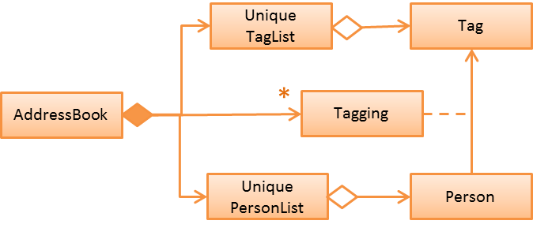

# Learning Outcomes
After studying this code and completing the corresponding exercises, you should be able to,

1. [Apply Encapsulation `[LO-Encapsulation]`](#apply-encapsulation-lo-encapsulation)
1. [Implement a class `[LO-ImplementClass]`](https://github.com/se-edu/addressbook-level2/blob/master/doc/LearningOutcomes.md#implement-a-class-lo-implementclass)
1. [Follow the Single Responsibility Principle `[LO-SRP]`](https://github.com/se-edu/addressbook-level2/blob/master/doc/LearningOutcomes.md#follow-the-single-responsibility-principle-lo-srp)
1. [Handle Exceptions `[LO-Exceptions]`](#handle-exceptions-lo-exceptions)
1. [Use Inheritance to achieve code reuse `[LO-Inheritance]`](#use-inheritance-to-achieve-code-reuse-lo-inheritance)
1. [Follow Interface Segregation Principle `[LO-ISP]`](#follow-interface-segregation-principle-lo-isp)
1. [Use class-level members `[LO-ClassLevel]`](#use-class-level-members-lo-classlevel)
1. [Use Composition `[LO-Composition]`](#use-composition-lo-composition)
1. [Use Association Classes `[LO-AssociationClass]`](#use-association-classes-lo-associationclass)
1. [Use JUnit to implement unit tests `[LO-JUnit]`](#use-junit-to-implement-unit-tests-lo-junit)
1. [Use TDD `[LO-TDD]`](#use-tdd-lo-tdd)
1. [Work in a 2KLoC code base `[LO-2KLoC]`](#work-in-a-2kloc-code-base-lo-2kloc)

------------------------------------------------------------------------------------------------------

### Apply Encapsulation `[LO-Encapsulation]`
  
##### Exercise: Encapsulate `CommandResult` class members 

* A member of the `CommandResult` class is not encapsulated. i.e. it is visible outside the object.
  Hide it so that it can only be accessed using methods provided.

------------------------------------------------------------------------------------------------------

### Implement a class `[LO-ImplementClass]`

##### Exercise: Split `Address` into more classes 
* Assume the address is entered in the following format `a/BLOCK, STREET, UNIT, POSTAL_CODE` <br>
  e.g. `a/123, Clementi Ave 3, #12-34, 231534`
* Split the `Address` class as follows.<br>
  
* Update the user guide and tests to match.

------------------------------------------------------------------------------------------------------

### Follow the Single Responsibility Principle `[LO-SRP]`

The *Single Responsibility Principle (SRP)* states that a class should have only one reason to change. 
The code given follows SRP to a reasonable extent, but there are places where it can be applied further.
  
##### Exercise: Split `TextUi` class 

The exercise in the `LO-ImplementClass` section is somewhat related to SRP as well. 
Here's a slightly more difficult exercise.

* `TextUi` class has more than one responsibility. 
  Try to extract out the responsibility of Formatting text for display (e.g. adding decorations) in to a 
  separate class named `Formatter`.

##### Resources
* [An explanation of the SRP](http://www.oodesign.com/single-responsibility-principle.html) from www.oodesign.com
* [Another explanation (more detailed)](http://code.tutsplus.com/tutorials/solid-part-1-the-single-responsibility-principle--net-36074) 
  by Patkos Csaba
* [A book chapter on SRP](https://drive.google.com/file/d/0ByOwmqah_nuGNHEtcU5OekdDMkk/view) by Robert C. Martin

------------------------------------------------------------------------------------------------------

### Handle Exceptions `[LO-Exceptions]`

##### Exercise: Handle 'file deleted' situation 

* The current code does not handle the situation where the user deletes the storage file while the
  AddressBook program is running. Use exceptions to handle that situation.

------------------------------------------------------------------------------------------------------

### Use Inheritance to achieve code reuse `[LO-Inheritance]`

Note how the `Command` class contains some code that is reused by some of its child classes. 
By defining `*Command` classes as child classes of `Command`, we have avoided having to duplicate those methods
in multiple `*Command` classes.

##### Exercise: Extract a `Contact` class 

* Extract commonalities from `Phone`, `Email` and `Address` classes into a parent class called `Contact`.<br>


------------------------------------------------------------------------------------------------------

### Follow Interface Segregation Principle `[LO-ISP]`

The *Interface-Segregation Principle (ISP)* states that no client should be forced to depend on methods it does not use.

Note how the `Person` class implements the `ReadOnlyPerson` interface so that clients who don't need write access to
`Person` objects can access `Person` objects through the `ReadOnlyPerson` interface instead.


##### Exercise: Add a `Printable` interface 

* Add a `Printable` interface as follows.<br>
  
* `Override` the `getPrintableString` in classes `Name`, `Phone`, `Email`, and `Address` so that each produces a printable
  string representation of the object. e.g. `Name: John Smith`, `Phone: 12349862`
* Add the following method in a suitable place of some other class. 
  Note how the method depends on the Interface.
  
  
  ```java
  /**
    * Returns a concatenated version of the printable strings of each object.
    */
  String getPrintableString(Printable... printables){
  ```
  
  The above method can be used to get a printable string representing a bunch of person details. 
  For example, you should be able to call that method like this:
  
  ```java
  //p is a Person object
  return getPrintableString(p.getPhone(), p.getEmail(), p.getAddress()); 
  ```

------------------------------------------------------------------------------------------------------

### Use class-level members `[LO-ClassLevel]`

Note how some of the variables and methods are declared `static`. That means they are *class-level* members
rather than *instance-level* members.<br>
e.g.<br> `Main.VERSION`, `Name.EXAMPLE`, `Utils.isAnyNull(...)`

##### Exercise: Add class-level members

* Convert the `parse(...)` method of the `Parser` class to a class-level method. Note how this method
  can be either class-level or instance-level.
* Note how the `setTags` method of the `Person` class cannot be converted to a class-level method.
* Add an instance-level member `int sequenceNumber` and a class-level variable `int nextSequenceNumber`
  to the `Person` class. Using these two variables, ensure that each `Person` object has a unique sequence number
  that indicates the order in which `Person` objects were created. e.g.
  * `Adam` is the first `Person` object to be created. It is assigned sequence number 1.
  * `Ben` and `Charlie` are created next, and assigned 2 and 3 respectively.
  * `Ben` is deleted.
  * `Daisy` is added next and is given sequence number 4.

------------------------------------------------------------------------------------------------------

### Use Composition `[LO-Composition]`

Note the following examples of *composition* (filled diamond):

Whole         | Parts
:------------ | :----------------------------------
`AddressBook` | `UniquePersonList` `UniqueTagList`
`Person`      | `Name` `Phone` `Email` `Address`

Contrast with these examples of *aggregration* (empty diamond):

Container           | Contained
:------------------ | :-------------------
`UniquePersonList`  | `Person`
`UuniqueTagList`    | `Tag`

------------------------------------------------------------------------------------------------------

### Use Association Classes `[LO-AssociationClass]`

The current design does not have any association classes.

##### Exercise: Add an Association Class `Tagging`

* Assume the following:
  1. There are commands to add and remove tags to a person in the address book.
  2. When the AddressBook program exits, it should print out a list of all the tags added/deleted during that session.
    e.g.

    ```sh
    + Jake Woo [friend]
    - Jake Woo [colleague]
    + Jean Wong [client]
    ```
* To support (ii) above, implement an Association Class called `Tagging` as given in the diagram below. <br>
  Each `Tagging` object will represent an adding or deleting of a tag for a specific person that happened
  during that session.<br>
  

------------------------------------------------------------------------------------------------------

### Use JUnit to implement unit tests `[LO-JUnit]`

Note the `test/seedu/addressbook/parser/ParserTest.java` class that users Junit to implement automated unit tests.

##### Exercise: Write unit tests for the `Utils` class

* Add a `test/seedu/addressbook/common/UtilsTest.java` containing JUnit tests for the `Utils` class.

------------------------------------------------------------------------------------------------------

### Use TDD `[LO-TDD]`

##### Exercise: Add a method in TDD fashion

* Add the following method to the `Name` class. Use the TDD technique to add the method. Commit after each step.

    ```java
    /**
      * Returns true of the other name is very similar to this name.
      * Two names are considered similar if ...
      */
      public boolean isSimilar(Name other) { ... }
    ```

* You may define 'similar' as you see fit.
  Make sure the definition covers scenarios where other name is `null`, in a different case, in a different order,
  is a subset/superset, etc. <br>
  e.g. `John K Smith` `John K SMITh` `John Smith` `Smith, John K`

------------------------------------------------------------------------------------------------------

### Work in a 2KLoC code base `[LO-2KLoC]`

##### Exercise: Enhance AddressBook

Add a feature to AddressBook. Here are some suggestions.
* An Edit command
* A Sort command
* List all persons automatically after an add or delete command
* Any other enhancement that you might see fit
